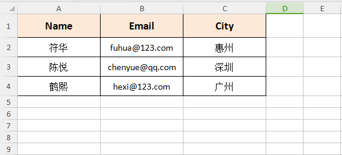
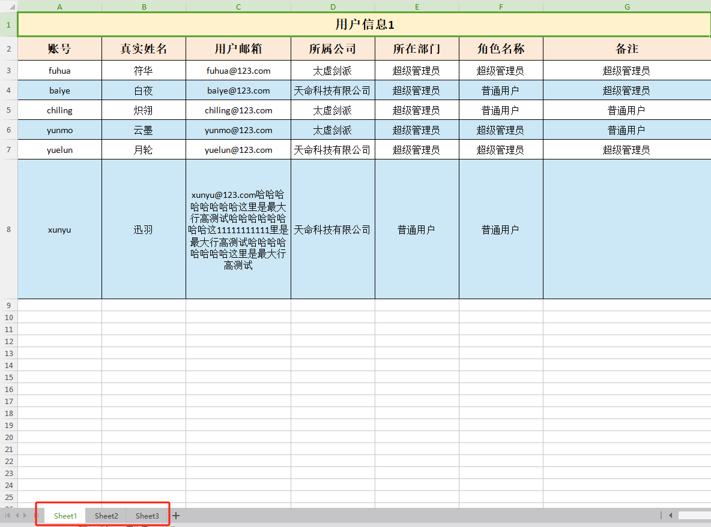
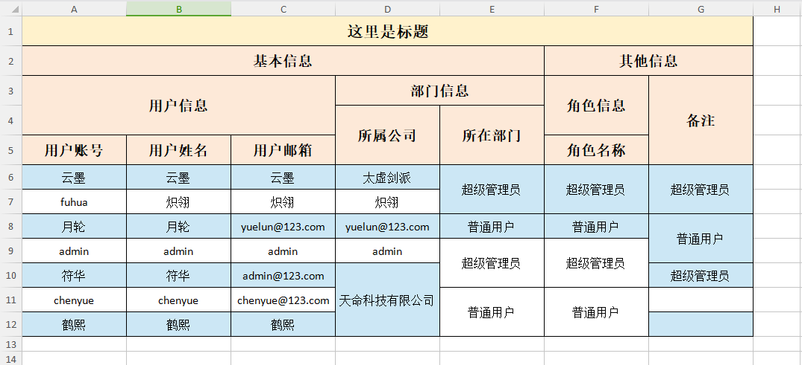
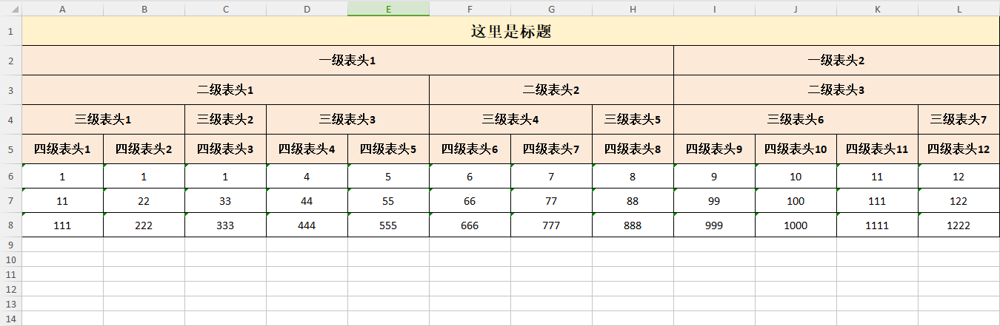
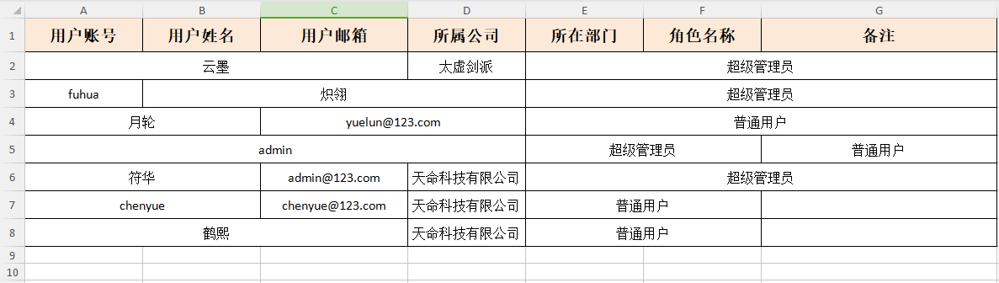
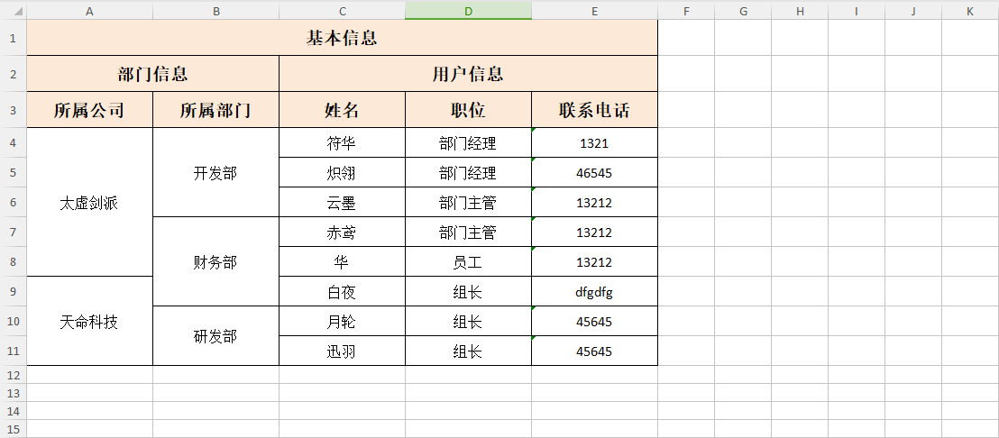

# 博客文章

<a href="https://blog.csdn.net/weixin_43165220/article/details/132906817">【Go】excelize库实现excel导入导出封装（一），自定义导出样式、隔行背景色、自适应行高、动态导出指定列、动态更改表头</a>

<a href="https://blog.csdn.net/weixin_43165220/article/details/132939884">【Go】excelize库实现excel导入导出封装（二），基于map、多个sheet、多级表头、树形结构表头导出，横向、纵向合并单元格导出</a>

<a href="https://blog.csdn.net/weixin_43165220/article/details/135367988">【Go】excelize库实现excel导入导出封装（三），基于excel模板导出excel</a>

# 目录结构说明
<table>
    <tr>
        <td></td>
    </tr>
</table>

# 导出效果图
<table>
    <tr>
        <td>map数据导出</td>
        <td></td>
    </tr>
    <tr>
        <td>单sheet导出</td>
        <td></td>
    </tr>
    <tr>
        <td>多sheet导出</td>
        <td></td>
    </tr>
    <tr>
        <td>复杂表头导出</td>
        <td></td>
    </tr>
    <tr>
        <td>复杂表头导出</td>
        <td></td>
    </tr>
    <tr>
        <td>横向合并导出</td>
        <td></td>
    </tr>
    <tr>
        <td>纵向合并导出</td>
        <td></td>
    </tr>
    <tr>
        <td>纵向合并导出</td>
        <td></td>
    </tr>
</table>
